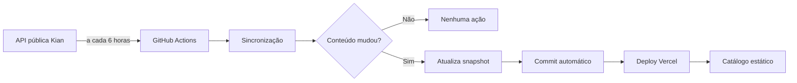

# Plataforma FENAREM

[](https://plataformafenarem.vercel.app)
[](https://nextjs.org/)
[](https://www.typescriptlang.org/)

Mapa interativo desenvolvido para orientar visitantes durante a FENAREM — Feira de Negócios Anual da Rede Elétrica e Maxxirede.

O projeto transforma a planta oficial do evento em uma experiência navegável para totens, telas touch, computadores, tablets e celulares. Visitantes podem buscar expositores, localizar stands e consultar áreas de serviço sem perder a fidelidade visual do mapa.

**[Acessar aplicação em produção](https://plataformafenarem.vercel.app)**

## Sobre o projeto

A aplicação foi criada para uso real durante a FENAREM e também documenta um estudo de caso de produto digital para eventos presenciais. O principal desafio técnico foi sobrepor interações precisas a uma planta complexa, mantendo coordenadas, inclinações e proporções em diferentes resoluções.

Não há banco de dados ou backend: os dados do evento são estruturados em TypeScript e entregues como conteúdo estático otimizado pela Vercel.

## Principais recursos

- Busca por expositor, categoria ou código do stand.
- Seleção do primeiro resultado por **Enter** ou pelo botão **Concluir** do teclado virtual.
- Teclado virtual próprio para operação em totens e telas touch.
- 76 stands mapeados com polígonos individuais.
- Pan, zoom, tela cheia e centralização do mapa.
- Destaque visual persistente do stand selecionado.
- Atalhos para serviços e áreas importantes do evento.
- Painel com informações e acesso ao catálogo dos expositores.
- Sugestões de stands ao abrir a busca.
- Retorno automático à posição inicial após inatividade.
- Navegação responsiva e acessível por mouse, teclado e toque.
- Planta SVG em alta fidelidade, com precisão geométrica e textual.

## Tecnologias

| Tecnologia | Aplicação |
| --- | --- |
| Next.js 15 | Framework, roteamento e build |
| React 19 | Interface e gerenciamento de estado |
| TypeScript | Tipagem e modelagem dos dados |
| SVG | Planta, polígonos e interações |
| CSS | Layout responsivo, animações e estados |
| Lucide React | Ícones da interface |
| Vercel | Build, hospedagem e entrega contínua |
| pnpm | Gerenciamento de dependências |

## Arquitetura

```text
plataforma_fenarem/
├── public/
│   ├── brands/                    # Marcas vetoriais
│   └── reference/                 # Planta oficial do evento
├── src/
│   ├── app/                       # Rotas, layout e estilos globais
│   ├── components/
│   │   ├── interactive-map/       # Busca, teclado e interface principal
│   │   └── map/                   # Renderização e interação do mapa
│   ├── data/
│   │   └── fairMap/               # Stands e áreas especiais
│   ├── lib/                       # Busca e eventos analíticos
│   ├── services/                  # Composição dos dados
│   └── types/                     # Contratos TypeScript
├── next.config.ts
├── package.json
└── pnpm-lock.yaml
```

### Sistema de coordenadas

A camada interativa usa uma base de `8000 × 4500`. Cada stand é representado por um polígono com pontos absolutos:

```ts
{
  id: "C03",
  code: "O05",
  name: "3M",
  type: "stand",
  precision: "verified",
  points: [
    { x: 2454, y: 2010 },
    { x: 2652, y: 1871 },
    { x: 2791, y: 2069 },
    { x: 2593, y: 2208 }
  ]
}
```

O `viewBox` do SVG preserva a geometria em telas Full HD, 2K, ultrawide e 4K. Os polígonos acompanham a planta sem conversões por resolução.

## Executando localmente

### Requisitos

- Node.js 20 ou superior.
- pnpm 8 ou superior.

### Instalação

```bash
git clone https://github.com/phaaael/plataforma_fenarem.git
cd plataforma_fenarem
pnpm install
```

### Desenvolvimento

```bash
pnpm dev
```

Acesse [http://localhost:3000/mapa](http://localhost:3000/mapa).

### Validação e produção

```bash
pnpm typecheck
pnpm build
pnpm start
```

## Parâmetros úteis

O ponto de origem do visitante pode ser informado pela URL:

```text
/mapa?kiosk=entrada
```

O editor visual de hotspots pode ser habilitado apenas durante o desenvolvimento:

```text
/mapa?mapDebug=true
```

## Deploy

O projeto está conectado à Vercel. Cada atualização da branch `main` gera uma nova publicação de produção.

Para criar outro projeto manualmente:

1. Importe este repositório na Vercel.
2. Mantenha o preset **Next.js**.
3. Use `pnpm build` como comando de build.
4. Não é necessário configurar variáveis de ambiente.

## Manutenção dos dados

- Expositores: `src/data/exhibitors.ts`
- Stands e polígonos: `src/data/fairMap/stands.ts`
- Áreas especiais: `src/data/fairMap/specialAreas.ts`
- Serviços e atalhos: `src/data/locations.ts`
- Pontos de origem: `src/data/kiosks.ts`
- Catálogo local da Kian: `src/data/kian-products.json`

Ao alterar a planta, preserve a ordem dos vértices e confira visualmente clique, toque, seleção e alinhamento em mais de uma resolução.

## Estudo de caso: catálogo interno da Kian

### Problema e decisão técnica

O stand da Kian precisava abrir seu catálogo dentro do mesmo modal dos outros expositores. A loja oficial, porém, envia `X-Frame-Options: SAMEORIGIN`, cabeçalho que faz o navegador recusar a página em um `iframe` de outro domínio. React, Next.js e CSS não conseguem alterar essa política.

Um proxy que removesse o cabeçalho foi descartado: além de contornar uma proteção deliberada, seria frágil diante dos scripts, cookies e rotas da VTEX. Também aumentaria o consumo da Vercel e o risco operacional durante o evento.

### Solução aplicada

Foi criada a rota `/catalogo/kian`, alimentada pela API pública oficial da categoria **Últimas Oportunidades — Até 50% OFF**. Os dados são normalizados e gravados em `src/data/kian-products.json`.



O acesso do visitante nunca consulta a API da Kian. A interface lê somente o snapshot incluído no build.

### Por que isso agrega valor

- **Desempenho previsível:** nenhuma requisição à API externa durante a navegação.
- **Resiliência:** se a loja ficar indisponível, o último catálogo válido continua no ar.
- **Menor latência:** os dados são entregues com a aplicação pela Vercel.
- **Menor carga externa:** o público do evento não multiplica chamadas à loja.
- **Deploy orientado a mudanças:** só existe novo build quando o conteúdo muda.
- **Histórico auditável:** alterações ficam registradas no Git.
- **Experiência consistente:** o visitante permanece dentro da Plataforma FENAREM.
- **Separação de responsabilidades:** a automação coleta; a interface apresenta.

Como peça de portfólio, a solução demonstra integração com API de terceiros, normalização de dados, cache persistente, automação CI/CD, tratamento de restrições de segurança e otimização para um ambiente real.

### Como a sincronização funciona

O script `scripts/sync-kian-catalog.mjs`:

1. Consulta a primeira página da categoria na API VTEX.
2. Lê o cabeçalho `resources` para descobrir o total de produtos.
3. Divide o catálogo em lotes de 50, limite da API.
4. Busca os lotes restantes em paralelo.
5. Consulta a ordenação oficial `OrderByTopSaleDESC`.
6. Marca os 24 primeiros itens como mais vendidos.
7. Mantém somente ID, nome, referência, descrição, categoria, link, imagem, texto alternativo e indicador de mais vendido.
8. Descarta preços, tokens de compra, pagamentos e dados sem uso na interface.
9. Gera um JSON determinístico: se a origem não mudou, o arquivo permanece idêntico.

A automação `.github/workflows/sync-kian-catalog.yml` roda a cada seis horas:

- sem diferenças, encerra sem commit e sem deploy;
- com diferenças, atualiza o snapshot e cria `chore: sincroniza catálogo da Kian`;
- se a API falhar, o snapshot publicado continua intacto.

Esse mecanismo funciona como cache persistente versionado, não como cache temporário do navegador ou de um processo.

### Interface e desempenho

O catálogo tem fundo branco e usa o logo vetorial oficial da Kian hospedado em `public/brands/kian.svg`. Os cards exibem imagem, nome, código, categoria e descrição, sem preços.

O filtro **Mais vendidos** funciona localmente e não chama a API. O CSS exibe somente os itens com `bestSeller`, e a contagem alterna entre o total do catálogo e os 24 líderes de venda.

As imagens usam `next/image`, carregamento sob demanda e uma origem restrita no `next.config.ts`. Assim, somente imagens próximas da área visível são carregadas, em dimensões adequadas ao dispositivo.

### Atualização e recuperação

A operação normal é automática. Em uma necessidade excepcional, a sincronização completa pode ser disparada pelo GitHub Actions ou localmente:

```bash
pnpm catalog:kian
```

Também existem comandos pontuais para diagnóstico ou recuperação:

```bash
# Atualiza ou inclui um produto pelo ID
pnpm catalog:kian -- --id=1190

# Remove um produto do snapshot
pnpm catalog:kian -- --remove=1190
```

Esses comandos não são necessários no uso cotidiano; a sincronização completa agendada é a fonte principal de manutenção.

### Trade-offs

- Uma mudança na loja pode levar até seis horas para chegar ao catálogo.
- “Mais vendidos” representa os 24 primeiros itens da ordenação oficial da VTEX no momento da sincronização.
- As imagens permanecem na infraestrutura pública da Kian, mas são carregadas sob demanda e processadas pelo Next.js.
- Links, descrições, imagens e identidade visual pertencem à Kian e são utilizados no contexto do evento.

## Qualidade

Antes de publicar uma alteração:

```bash
pnpm audit --prod
pnpm typecheck
pnpm build
```

Também é recomendado validar o fluxo completo em desktop, celular e dispositivo touch.

## Direitos de uso

O código-fonte está disponível publicamente como projeto de portfólio. Isso não concede licença automática para cópia, modificação ou redistribuição.

A identidade da FENAREM, a planta do evento, logotipos, marcas e catálogos pertencem aos seus respectivos titulares e são exibidos no contexto autorizado do evento. Para reutilização comercial ou institucional desses materiais, obtenha autorização dos responsáveis.
